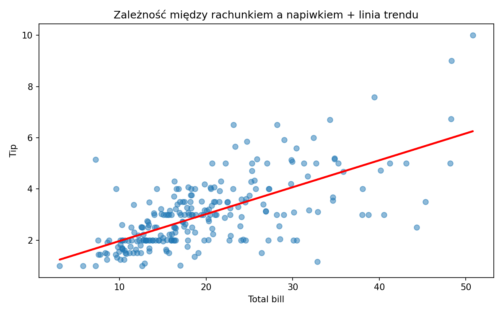

# Analiza napiwków – mini raport

## Cel analizy
Celem było zbadanie trzech pytań:
1. Czy palący dają większe napiwki niż niepalący?
2. Czy napiwki różnią się w zależności od płci?
3. W które dni średnie napiwki są najwyższe?

## Wyniki

### 1. Palący vs. niepalący
Średnie napiwki zarówno w grupie niepalących, jak i palących są zbliżone. Różnica między nimi wynosi 0.01 dolara, grupy te pod względem wysokości średnich napiwków są więc do siebie podobne

### 2. Kobiety vs. mężczyźni
W grupie mężczyzn średni napiwek jest wyższy o ok. 0.25 dolara, niż w grupie kobiet, co daje różnicę ok. 9%. Jest to różnica umiarkowana ale warta odnotowania

### 3. Dni tygodnia
Najwyższe napiwki klienci zostawiają w niedziele, najniższe zaś w czwartek i piątek. Różnice między napiwkami są umiarkowane, choć dni weekendowe (sobota, niedziela) charakteryzują się wyższymi średnimi napiwkami niż pozostałe dni tygodnia

## Podsumowanie
Analiza danych prowadzi do wniosku, że palenie nie wpływa na wysokość napiwków. Natomiast takie cechy jak płeć i dzień tygodnia mają umiarkowany wpływ na wysokość napiwków.

